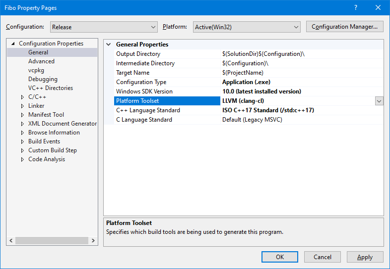

While Visual Studio (MSBuild) c++ projects can use Clang, if `vcpkg` is integrated, ie: installed globally for Visual Studio/MSBuild projects, then building the project will fail.

 

Instead, generating it as a Ninja project will allow to use both Clang and vcpkg.

# Requirement
**TLDR:** Install vcpkg as described [here](https://vcpkg.io/en/index.html). As admin, run `choco install cmake ninja llvm -y`. *Chocolatey is available [here](https://chocolatey.org/).*

The examples below presumes that:
1. LLVM/clang is installed and available from `C:\Program Files\LLVM\bin\`.
1. vcpkg is intalled in `C:\Code\vcpkg`,

## Issue with vcpkg integration

When vcpkg *is* integrated for Visual Studio, ie. `C:\Code\vcpkg\vcpkg integrate install`, the project can be build with Ninja/Clang and MSBuild/cl, but will fail with MSBuild/Clang.

### Build using Ninja and CLang
```powershell
rm -r -fo buildNinjaClang; 
cmake -GNinja  -S . -B buildNinjaClang `
  -DCMAKE_BUILD_TYPE:STRING=Release `
  "-DCMAKE_C_COMPILER:FILEPATH=C:\Program Files\LLVM\bin\clang.exe" `
  "-DCMAKE_CXX_COMPILER:FILEPATH=C:\Program Files\LLVM\bin\clang++.exe" `
  "-DCMAKE_RC_COMPILER:FILEPATH=C:\Program Files\LLVM\bin\llvm-rc.exe" `
  "-DCMAKE_TOOLCHAIN_FILE=C:\Code\vcpkg\scripts\buildsystems\vcpkg.cmake"

cmake --build .\buildNinjaClang\ --target all
.\buildNinjaClang\fibo.exe
```

Works.

### Build using MSBuild and cl.exe

```powershell
rm -r -fo buildMSBuild; 
cmake -G"Visual Studio 16 2019" -T ClangCl -A Win32  -S . -B buildMSBuild `
  -D CMAKE_TOOLCHAIN_FILE="C:\Code\vcpkg\scripts\buildsystems\vcpkg.cmake"

cmake --build .\buildMSBuild\ --config Release
.\buildMSBuild\Release\fibo.exe
```

Works.

### Build using MSBuild and CLang

```powershell
rm -r -fo buildMSBuildClang; 
cmake -G"Visual Studio 16 2019" -T ClangCl -A Win32  -S . -B buildMSBuildClang `
  -D CMAKE_TOOLCHAIN_FILE="C:\Code\vcpkg\scripts\buildsystems\vcpkg.cmake"

cmake --build .\buildMSBuildClang\ --config Release
.\buildMSBuildClang\Release\fibo.exe
```

This fails during the configuration with the output (full version [here](./doc/FullOutputFailingConfiguration.md)):
```powershell
...
-- Selecting Windows SDK version 10.0.19041.0 to target Windows 10.0.19044.
-- The CXX compiler identification is unknown
CMake Error at CMakeLists.txt:3 (project):
  No CMAKE_CXX_COMPILER could be found.
...
```

And with the following in `CMakeError.log` (full version [here](./doc/CMakeError.log)):
```CMake
...
Link:
  C:\Program Files (x86)\Microsoft Visual Studio\2019\Professional\VC\Tools\Llvm\bin\lld-link.exe /OUT:".\CompilerIdCXX.exe" /INCREMENTAL:NO /LIBPATH:"C:\Code\vcpkg\installed\x86-windows\lib" /LIBPATH:"C:\Code\vcpkg\installed\x86-windows\lib\manual-link" kernel32.lib user32.lib gdi32.lib winspool.lib comdlg32.lib advapi32.lib shell32.lib ole32.lib oleaut32.lib uuid.lib odbc32.lib odbccp32.lib "C:\Code\vcpkg\installed\x86-windows\lib\*.lib" /MANIFEST /MANIFESTUAC:"level='asInvoker' uiAccess='false'" /manifest:embed /PDB:".\CompilerIdCXX.pdb" /SUBSYSTEM:CONSOLE /DYNAMICBASE /NXCOMPAT /IMPLIB:".\CompilerIdCXX.lib"  Debug\CMakeCXXCompilerId.obj
lld-link : error : could not open 'C:\Code\vcpkg\installed\x86-windows\lib\*.lib': invalid argument [C:\Users\philippeqc\source\repos\vcpkg\vcpkgAndClang\buildMSBuildClang\CMakeFiles\3.24.3\CompilerIdCXX\CompilerIdCXX.vcxproj]
Done Building Project "C:\Users\philippeqc\source\repos\vcpkg\vcpkgAndClang\buildMSBuildClang\CMakeFiles\3.24.3\CompilerIdCXX\CompilerIdCXX.vcxproj" (default targets) -- FAILED.

Build FAILED.
...
```


# Conclusion
Even if vcpkg is integrated (for MSBuild), one can still build projects with CLang (for example with Ninja), so long it isn't as a MSBuild project. Otherwise, disable the integration of vcpkg with MSBuild, ie. `C:\Code\vcpkg\vcpkg integrate remove`
